## JS Objects

### Learn to
Learn a programming construct by exploring and reasoning about examples.

### Exercise
Understand the following examples in turn. Listed [here](https://hackmd.io/LNOhghGETu2Mry0LYCGKwQ?view).

#### 1

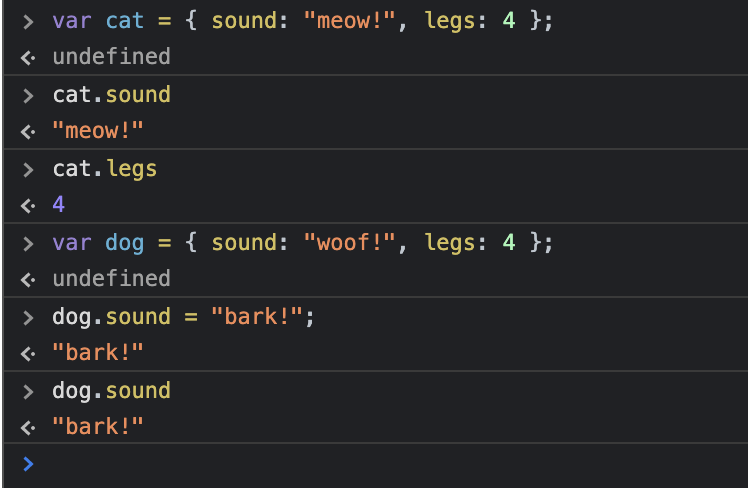

#### 2

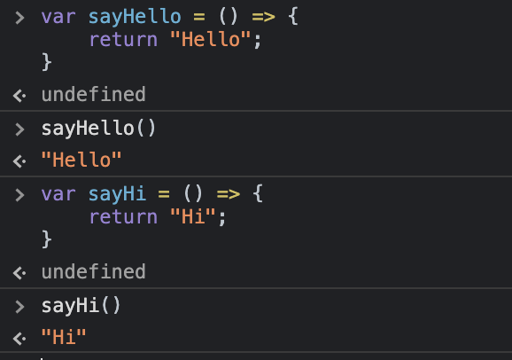

#### 3

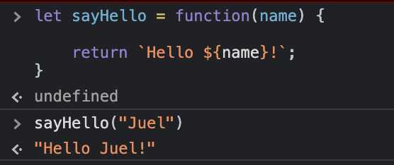
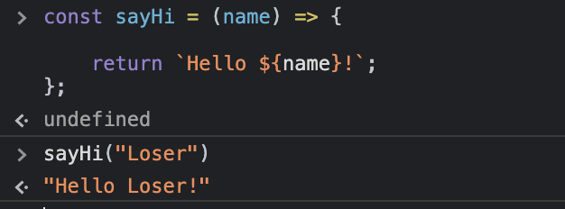

#### 4

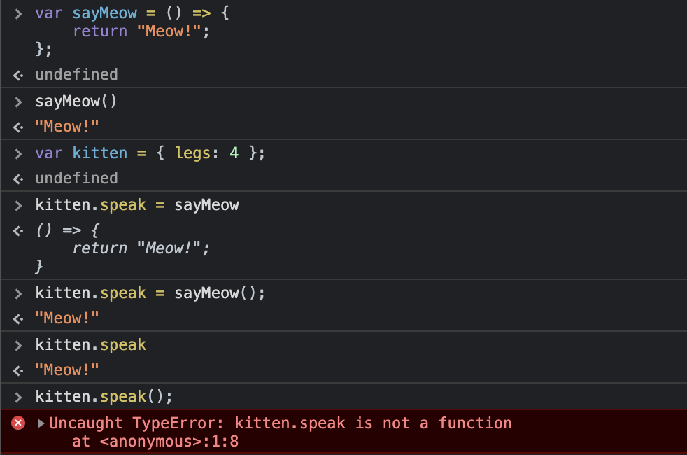

#### 5

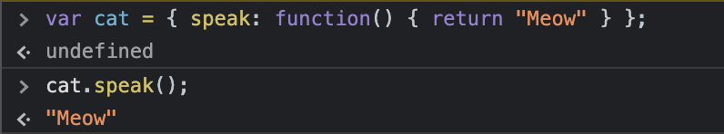

#### 6

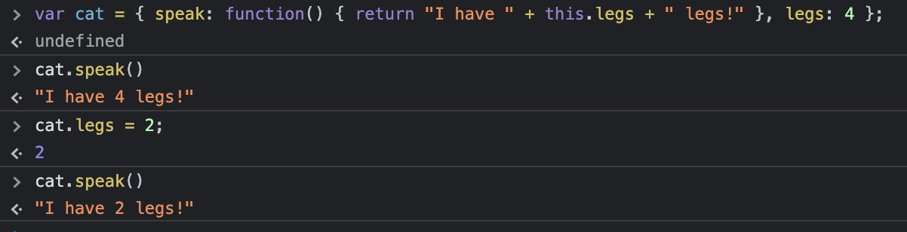

#### 7

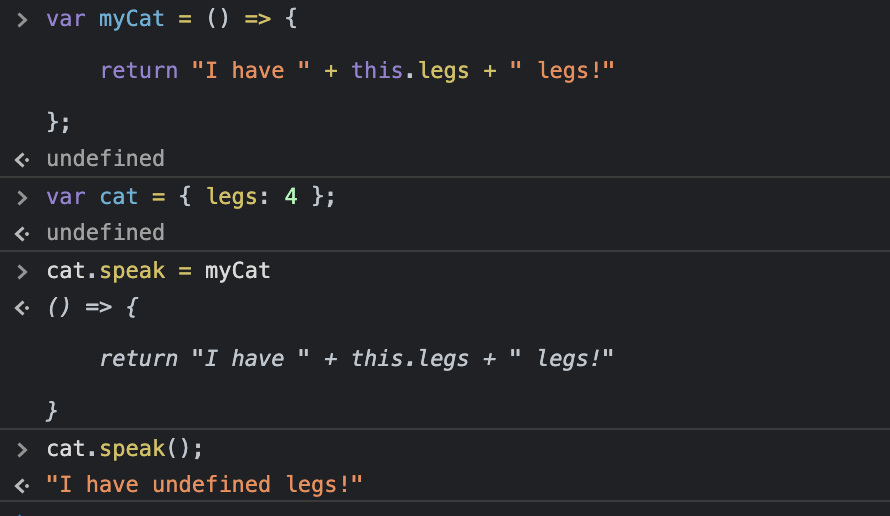
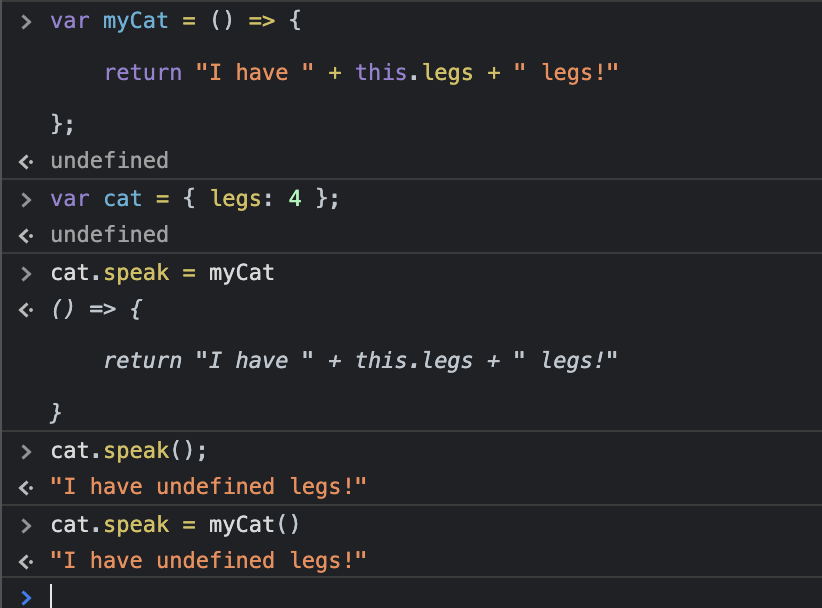

#### 8

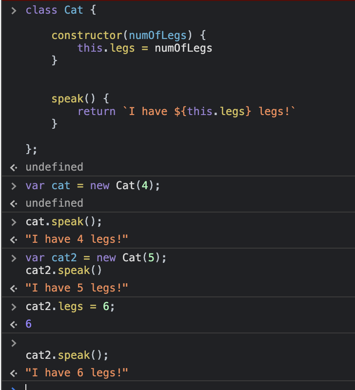

#### 9

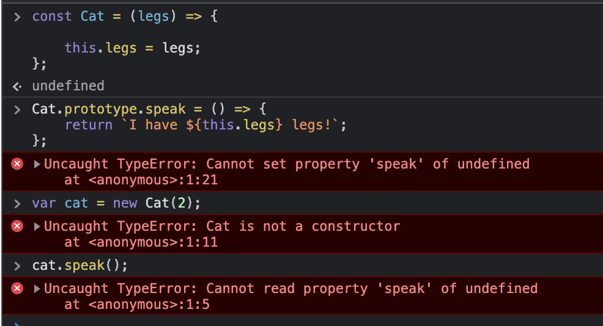
